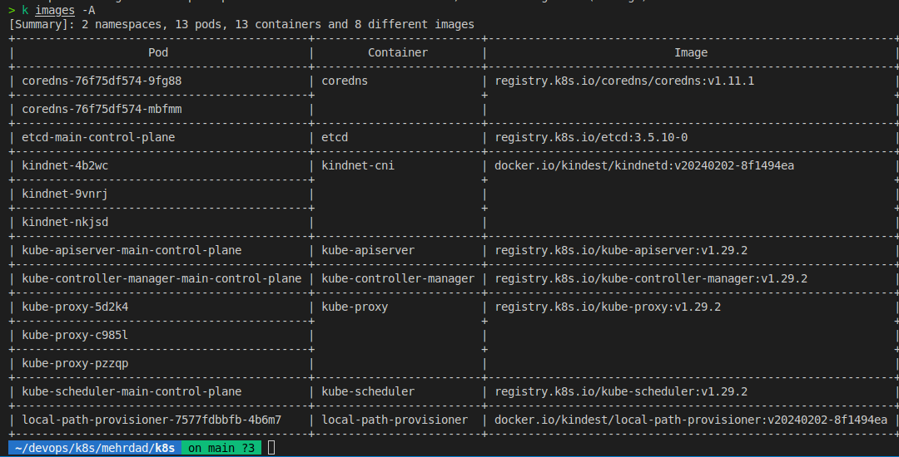

# Kubectl Commands Tips

#
### Installation and configuration:

Update the apt package index and install packages needed to use the Kubernetes apt repository:

```bash
sudo apt-get update
sudo apt-get install -y apt-transport-https ca-certificates curl
```

Download the Google Cloud public signing key:

```bash
sudo curl -fsSLo /usr/share/keyrings/kubernetes-archive-keyring.gpg https://dl.k8s.io/apt/doc/apt-key.gpg
```

Add the Kubernetes apt repository:

```bash
echo "deb [signed-by=/usr/share/keyrings/kubernetes-archive-keyring.gpg] https://apt.kubernetes.io/ kubernetes-xenial main" | sudo tee /etc/apt/sources.list.d/kubernetes.list
```

Update apt package index with the new repository and install kubectl:

```bash
sudo apt-get update
sudo apt-get install -y kubectl
```

Check all version:

```bash
apt-cache policy kubectl
```

#### Bash completion:

Install bash-completion:

```bash
apt-get install bash-completion
```

Enable kubectl autocompletion:

```bash
echo 'source <(kubectl completion bash)' >>~/.bashrc
kubectl completion bash >/etc/bash_completion.d/kubectl
```

If you have an alias for kubectl, you can extend shell completion to work with that alias:

```bash
echo 'alias k=kubectl' >>~/.bashrc
echo 'complete -F __start_kubectl k' >>~/.bashrc
```

Good alias:

```bash
alias kg='kubectl get'
alias klo='kubectl logs -f'
```

#
### [Kubectl Sample Commands](kubectl-sample-command.md)

# OIDC
 
#
### images
- [kubectl-images:](https://github.com/chenjiandongx/kubectl-images) Show container images used in the cluster



### kubent
- [kubent:](https://github.com/doitintl/kube-no-trouble) Easily check your clusters for use of deprecated APIs


### Validating Kubernetes YAML for best practice

#
#### Kubeval:
The premise of [kubeval](https://www.kubeval.com) is that any interaction with Kubernetes goes via its REST API.
Hence, you can use the API schema to validate whether a given YAML input conforms to the schema.

Installations:

```bash
wget https://github.com/instrumenta/kubeval/releases/latest/download/kubeval-linux-amd64.tar.gz
tar xf kubeval-linux-amd64.tar.gz
sudo cp kubeval /usr/local/bin
sudo chmod +x /usr/local/bin/kubeval
```

Check Yaml file:

```bash
kubeval additional-properties.yaml
kubeval --strict additional-properties.yaml
cat my-invalid-rc.yaml | kubeval
```

You can test a specific API version using the flag `--kubernetes-version`:

```bash
kubeval --kubernetes-version 1.16.1 base-valid.yaml
```

#
#### [Kube-score](https://github.com/zegl/kube-score)

Kube-score analyses YAML manifests and scores them against in-built checks.

These checks are selected based on security recommendations and best practices, such as:

- Running containers as a non-root user.
- Specifying health checks for pods.
- Defining resource requests and limits.

Installation:

```bash
kubectl krew install score
```

Usage:

```bash
kube-score score simple-pod.yml
kube-score score simple-pod.yml --output-format ci
```

#
### Kubectl add-ons:

#
#### [fzf](https://github.com/junegunn/fzf#using-linux-package-managers) is a general-purpose command-line fuzzy finder.

It's an interactive Unix filter for command-line that can be used with any list; files, command history, processes, hostnames, bookmarks, git commits, etc.

Installation:

```bash
sudo apt-get install fzf
```

#
#### [Krew](https://github.com/kubernetes-sigs/krew) is the plugin manager for kubectl command-line tool.
Installation:

```bash
(
  set -x; cd "$(mktemp -d)" &&
  OS="$(uname | tr '[:upper:]' '[:lower:]')" &&
  ARCH="$(uname -m | sed -e 's/x86_64/amd64/' -e 's/\(arm\)\(64\)\?.*/\1\2/' -e 's/aarch64$/arm64/')" &&
  curl -fsSLO "https://github.com/kubernetes-sigs/krew/releases/download/v0.4.4/krew-linux_amd64.tar.gz" &&
  mv krew-linux_amd64.tar.gz krew.tar.gz
  tar zxvf krew.tar.gz &&
  KREW=./krew-"${OS}_${ARCH}" &&
  "$KREW" install krew &&
  echo 'export PATH="${KREW_ROOT:-$HOME/.krew}/bin:$PATH"' >> ~/.bashrc &&
  export PATH="${KREW_ROOT:-$HOME/.krew}/bin:$PATH"
)
```

#
#### [kubectx + kubens:](https://github.com/ahmetb/kubectx) Power tools for kubectl.

kubectx helps you switch between clusters back and forth
kubens helps you switch between Kubernetes namespaces smoothly

Installation:

```bash
kubectl krew install ctx
kubectl krew install ns
# OR
sudo apt install kubectx
```

Good alias:

```bash
echo '
# kubectx
alias kctx="kubectl ctx"
alias kubectx="kubectl ctx"

# kubens
alias kns="kubectl ns"
alias kubens="kubectl ns"
'  >> ~/.bashrc
```
#
### [kube-ps1:](https://github.com/jonmosco/kube-ps1) Kubernetes prompt for bash and zsh.

A script that lets you add the current Kubernetes context and namespace configured on kubectl to your Bash/Zsh prompt strings (i.e. the $PS1).


add this line on ~/.zshrc

before install kube-ps1 install zsh and plugins:
[install zsh and plugin:]( ../../../linux/zsh_installation.md)

```bash
wget https://raw.githubusercontent.com/jonmosco/kube-ps1/master/kube-ps1.sh
mv kube-ps1.sh ~/.oh-my-zsh/plugins/kube-ps1/kube-ps1.plugin.zsh
```

Add these line in `~/.zshrc` file:

```bash
source ~/.oh-my-zsh/plugins/kube-ps1/kube-ps1.plugin.zsh
PROMPT=$PROMPT'$(kube_ps1) '
source ~/.oh-my-zsh/plugins/kubectl/kubectl.plugin.zsh
RPROMPT='%{$fg[blue]%}($ZSH_KUBECTL_PROMPT)%{$reset_color%}'
```

#
#### Deprecations AKA [KubePug](https://github.com/rikatz/kubepug) - Pre UpGrade (Checker).

Installation:

```bash
kubectl krew install deprecations
# Usage
kubectl deprecations --help
```

#
#### [kube-shell:](https://github.com/cloudnativelabs/kube-shell)

Under the hood kube-shell still calls kubectl. Kube-shell aims to provide ease-of-use of kubectl and increasing productivity.

Installation:

The kube-shell requires python and pip to install. You can install the kube-shell using pip:

```bash
pip install kube-shell
```

Usage:

After installing kube-shell through pip, just run kube-shell to bring up shell.

At the kube-shell command prompt you can run exit or press F10 to exit the shell. You can clear the screen by running clear command.

By default drop-down suggestion list also displays in-line documentation, you can turn on/off inline documnetation by pressing F4 button.

You can run any shell command by prefixing command with "!". For e.g. !ls would list from the current directory.

#### [kail: kubernetes tail:](https://github.com/boz/kail)

Kubernetes tail. Streams logs from all containers of all matched pods. Match pods by service, replicaset, deployment, and others. Adjusts to a changing cluster - pods are added and removed from logging as they fall in or out of the selection.

Installing:

Kail binaries for Linux and OSX can be found on the latest release page. Download and install into your $GOPATH/bin or use the following command

```bash
kubectl krew install tail
```

### [kubectl-tree](https://github.com/ahmetb/kubectl-tree)

A kubectl plugin to explore ownership relationships between Kubernetes objects through ownersReferences on the objects.
The kubectl lineage plugin is very similar to kubectl tree, but it understands logical relationships between some API objects without needing ownerReferences.

Installation:

Use krew plugin manager to install:

```bash
kubectl krew install tree
kubectl tree --help
```


#### [kubecolor:](https://github.com/hidetatz/kubecolor) Colorize your kubectl output
```bash
alias k="kubecolor"
```

#### Others good Tips
- [kubectl-df-pv:](https://github.com/yashbhutwala/kubectl-df-pv) A kubectl plugin to see df for persistent volumes.

- [kurt:](https://github.com/soraro/kurt) KUbernetes Restart Tracker


